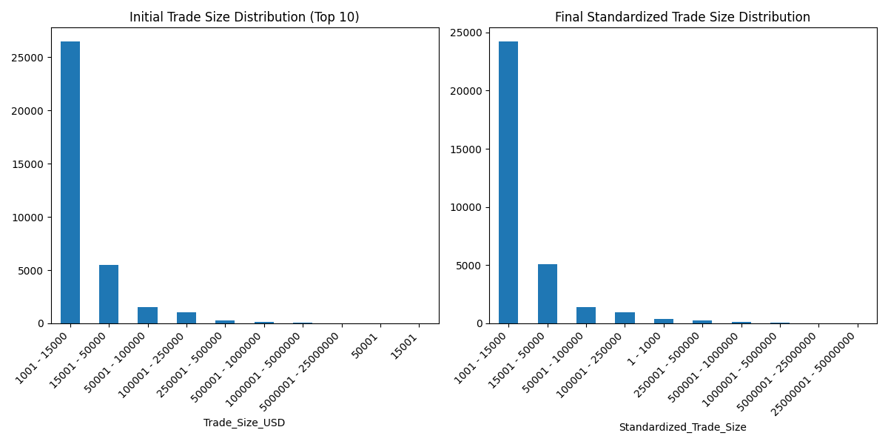
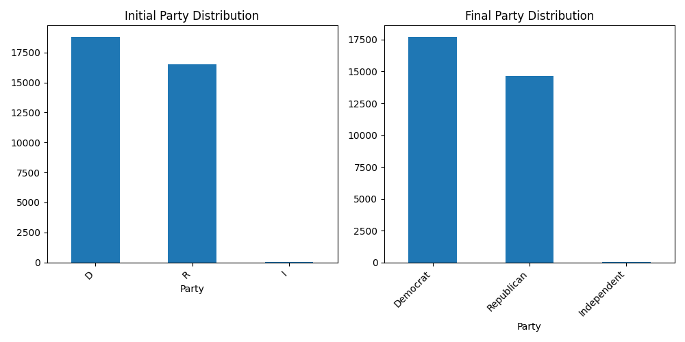
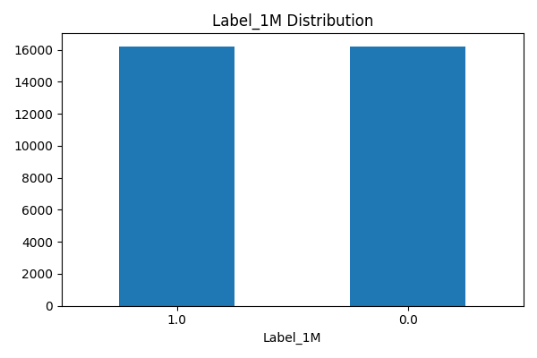
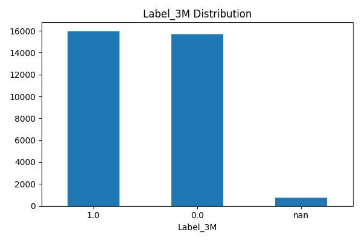
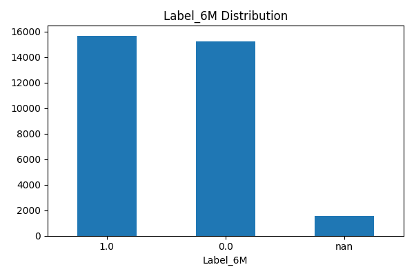
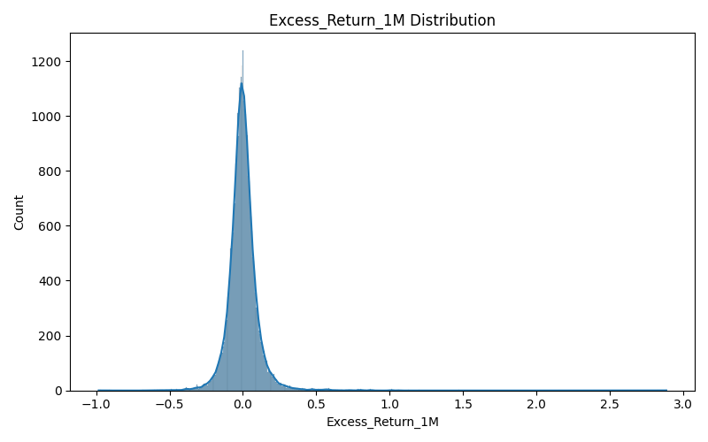
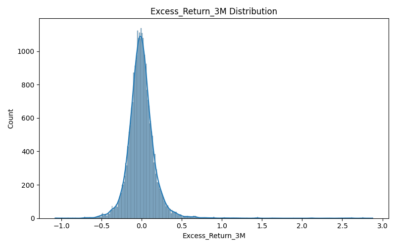
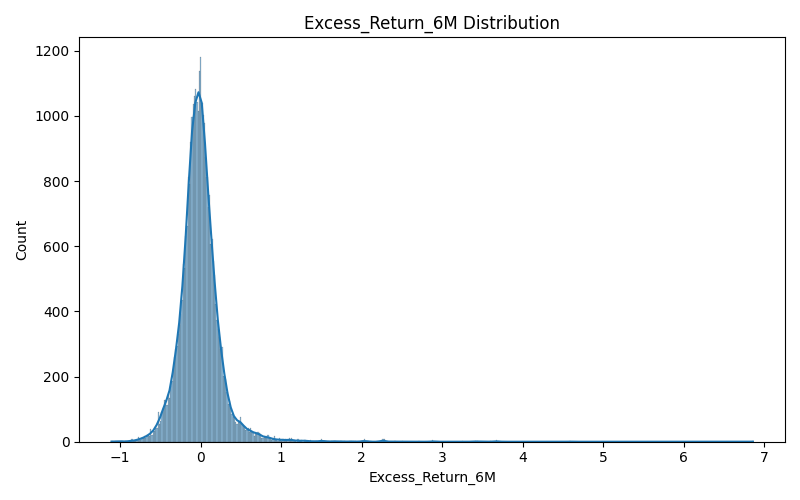

# Data Processing Comparison Report

This report details the changes and transformations applied to the financial transaction data throughout the processing pipeline, comparing the initial `v5_transactions_with_approp_ticker.csv` with the final `v9_transactions.csv`.

## 1. Basic Data Information

### Initial Data (`v5_transactions_with_approp_ticker.csv`)
- Rows: 35365
- Columns: 26
- Column Names: Ticker, TickerType, Company, Traded, Transaction, Trade_Size_USD, Status, Subholding, Description, Name, BioGuideID, Filed, Party, District, Chamber, Comments, Quiver_Upload_Time, excess_return, State, last_modified, Short, Committees, Industry, Sector, In_SP100, Appropriate_Ticker

### Final Data (`v9_transactions.csv`)
- Rows: 32416
- Columns: 47
- Column Names: ID, Ticker, TickerType, Company, Traded, Transaction, Trade_Size_USD, Status, Name, BioGuideID, Filed, Party, Chamber, Comments, Quiver_Upload_Time, excess_return, State, last_modified, Committees, Industry, Sector, In_SP100, Appropriate_Ticker, SPY_TradeDate, SPY_1Month, SPY_3Months, SPY_6Months, Close_TradeDate, Close_1Month, Close_3Months, Close_6Months, Stock_Return_1M, SPY_Return_1M, Excess_Return_1M, Beat_SPY_6pct_1M, Stock_Return_3M, SPY_Return_3M, Excess_Return_3M, Beat_SPY_6pct_3M, Stock_Return_6M, SPY_Return_6M, Excess_Return_6M, Beat_SPY_6pct_6M, Label_1M, Label_3M, Label_6M, Standardized_Trade_Size

## 2. Column Differences

- Columns Added: Excess_Return_1M, Stock_Return_6M, Close_1Month, Close_3Months, ID, Beat_SPY_6pct_1M, Close_6Months, SPY_1Month, Excess_Return_3M, Standardized_Trade_Size, SPY_6Months, SPY_Return_6M, Close_TradeDate, SPY_3Months, SPY_Return_3M, SPY_Return_1M, Excess_Return_6M, Beat_SPY_6pct_6M, Beat_SPY_6pct_3M, Label_3M, Label_6M, Stock_Return_3M, SPY_TradeDate, Stock_Return_1M, Label_1M
- Columns Removed: Subholding, District, Short, Description
- Common Columns: Ticker, State, BioGuideID, TickerType, Committees, Industry, Chamber, Filed, Transaction, Appropriate_Ticker, Status, Quiver_Upload_Time, In_SP100, Company, excess_return, Comments, Traded, Party, Name, Sector, Trade_Size_USD, last_modified

## 3. Row Count Change

- Number of rows removed during processing: 2949

## 4. Detailed Column Analysis

### Transaction Column Changes

#### Initial Transaction Distribution
```
Transaction
Purchase          17222
Sale              13711
Sale (Full)        2323
Sale (Partial)     1843
Exchange            266
Name: count, dtype: int64
```

#### Final Transaction Distribution
```
Transaction
Sale        16466
Purchase    15950
Name: count, dtype: int64
```

### Trade Size Standardization

The `Trade_Size_USD` column from the initial data was standardized into `Standardized_Trade_Size` in the final data.

#### Initial Trade Size Distribution (`Trade_Size_USD`)
```
Trade_Size_USD
1001 - 15000       26450
15001 - 50000       5468
50001 - 100000      1495
100001 - 250000     1035
250001 - 500000      279
Name: count, dtype: int64
```

#### Final Standardized Trade Size Distribution (`Standardized_Trade_Size`)
```
Standardized_Trade_Size
1001 - 15000           24200
15001 - 50000           5065
50001 - 100000          1397
100001 - 250000          953
1 - 1000                 365
250001 - 500000          264
500001 - 1000000         102
1000001 - 5000000         54
5000001 - 25000000        15
25000001 - 50000000        1
Name: count, dtype: int64
```



### Party Affiliation Standardization

The `Party` column abbreviations were mapped to full names.

#### Initial Party Distribution
```
Party
D    18807
R    16499
I       59
Name: count, dtype: int64
```

#### Final Party Distribution
```
Party
Democrat       17722
Republican     14638
Independent       56
Name: count, dtype: int64
```



### Transaction ID Addition

A unique `ID` column was added to the final dataset.

- Example IDs: [1, 2, 3, 4, 5]

### Trading Labels

New binary trading labels (`Label_1M`, `Label_3M`, `Label_6M`) were added.

#### Label_1M Distribution
```
Label_1M
1.0    16209
0.0    16207
Name: count, dtype: int64
```



#### Label_3M Distribution
```
Label_3M
1.0    15963
0.0    15705
NaN      748
Name: count, dtype: int64
```



#### Label_6M Distribution
```
Label_6M
1.0    15670
0.0    15207
NaN     1539
Name: count, dtype: int64
```



### Excess Returns

Excess return columns (`Excess_Return_1M`, `Excess_Return_3M`, `Excess_Return_6M`) were calculated.

#### Excess_Return_1M Summary Statistics
```
count    32416.000000
mean        -0.000053
std          0.103205
min         -0.983810
25%         -0.048413
50%         -0.004067
75%          0.042240
max          2.887518
Name: Excess_Return_1M, dtype: float64
```



#### Excess_Return_3M Summary Statistics
```
count    31668.000000
mean        -0.003570
std          0.179003
min         -1.077220
25%         -0.095230
50%         -0.011541
75%          0.073704
max          2.878813
Name: Excess_Return_3M, dtype: float64
```



#### Excess_Return_6M Summary Statistics
```
count    30877.000000
mean        -0.009903
std          0.270507
min         -1.108928
25%         -0.144420
50%         -0.024901
75%          0.098791
max          6.858436
Name: Excess_Return_6M, dtype: float64
```



## 5. Missing Values Analysis

### Initial Data Missing Values
```
Short                 35314
Comments              34525
Description           32785
Subholding            14042
District               8227
Appropriate_Ticker     1565
excess_return          1522
Industry                232
Sector                  231
Committees              218
Status                   79
last_modified            70
dtype: int64
```

### Final Data Missing Values
```
Comments            31660
SPY_6Months          1539
Label_6M             1539
Excess_Return_6M     1539
SPY_Return_6M        1539
Stock_Return_6M      1526
Close_6Months        1526
excess_return        1140
SPY_Return_3M         748
Excess_Return_3M      748
Label_3M              748
SPY_3Months           748
Close_3Months         739
Stock_Return_3M       739
Status                 77
last_modified          69
dtype: int64
```

