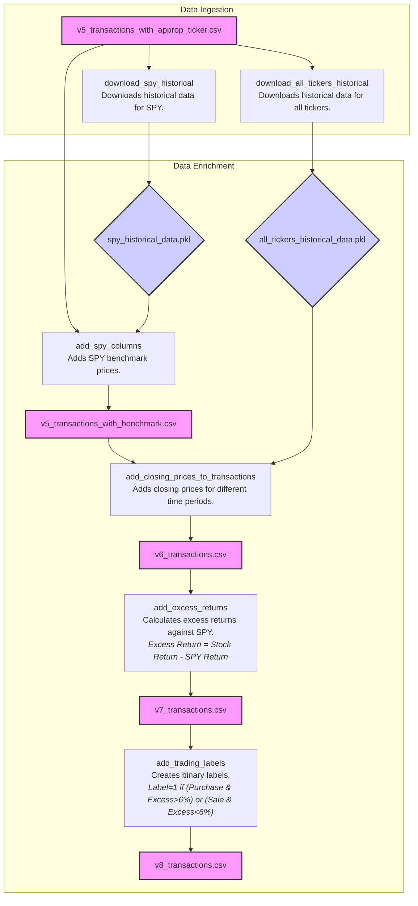
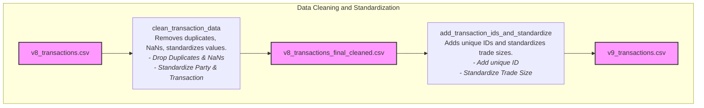

### Data Processing Flow

```mermaid
graph TD
    subgraph "Data Ingestion"
        A[v5_transactions_with_approp_ticker.csv] --> B["download_all_tickers_historical<br/>Downloads historical data for all tickers."];
        A --> C["download_spy_historical<br/>Downloads historical data for SPY."];
    end

    subgraph "Data Enrichment"
        B --> D{all_tickers_historical_data.pkl};
        C --> E{spy_historical_data.pkl};
        A --> F["add_spy_columns<br/>Adds SPY benchmark prices."];
        E --> F;
        F --> G[v5_transactions_with_benchmark.csv];
        G --> H["add_closing_prices_to_transactions<br/>Adds closing prices for different time periods."];
        D --> H;
        H --> I[v6_transactions.csv];
        I --> J["add_excess_returns<br/>Calculates excess returns against SPY.<br/><i>Excess Return = Stock Return - SPY Return</i>"];
        J --> K[v7_transactions.csv];
        K --> L["add_trading_labels<br/>Creates binary labels.<br/><i>Label=1 if (Purchase & Excess>6%) or (Sale & Excess<6%)</i>"];
        L --> M[v8_transactions.csv];
    end

    style A fill:#f9f,stroke:#333,stroke-width:2px
    style G fill:#f9f,stroke:#333,stroke-width:2px
    style I fill:#f9f,stroke:#333,stroke-width:2px
    style K fill:#f9f,stroke:#333,stroke-width:2px
    style M fill:#f9f,stroke:#333,stroke-width:2px
    style D fill:#ccf,stroke:#333,stroke-width:2px
    style E fill:#ccf,stroke:#333,stroke-width:2px
```

### Data Cleaning and Standardization

```mermaid
graph TD
    subgraph "Data Cleaning and Standardization"
        M[v8_transactions.csv] --> N["clean_transaction_data<br/>Removes duplicates, NaNs, standardizes values.<br/><i>- Drop Duplicates & NaNs<br/>- Standardize Party & Transaction</i>"];
        N --> O[v8_transactions_final_cleaned.csv];
        O --> P["add_transaction_ids_and_standardize<br/>Adds unique IDs and standardizes trade sizes.<br/><i>- Add unique ID<br/>- Standardize Trade Size</i>"];
        P --> Q[v9_transactions.csv];
    end

    style M fill:#f9f,stroke:#333,stroke-width:2px
    style O fill:#f9f,stroke:#333,stroke-width:2px
    style Q fill:#f9f,stroke:#333,stroke-width:2px
```
